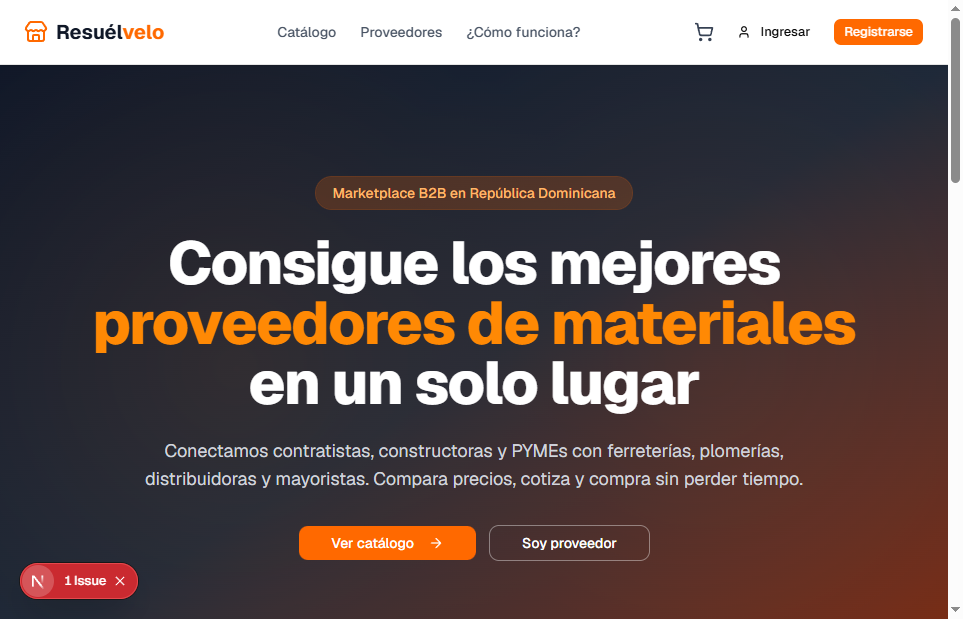
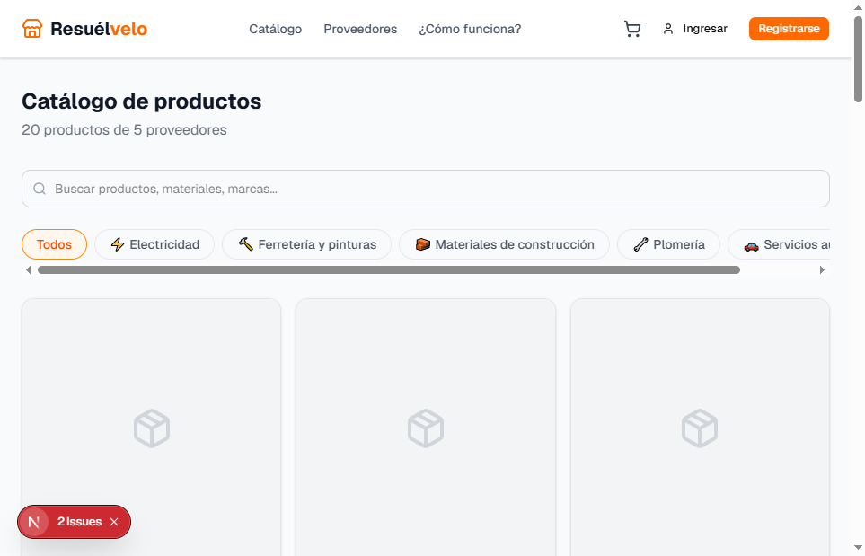
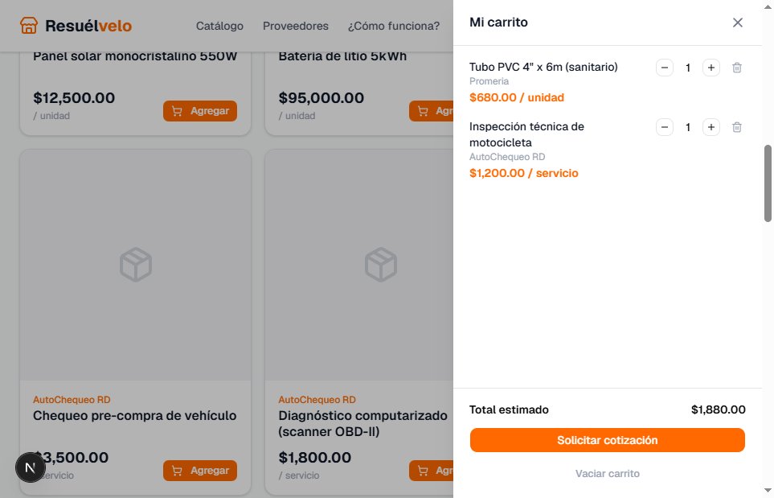
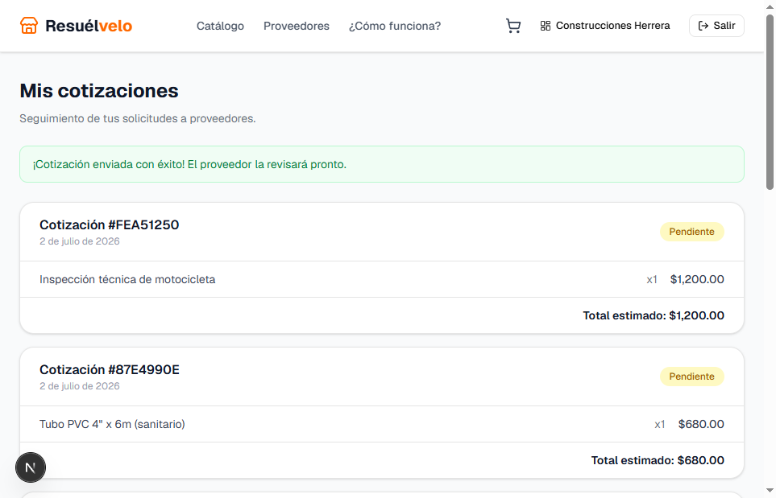
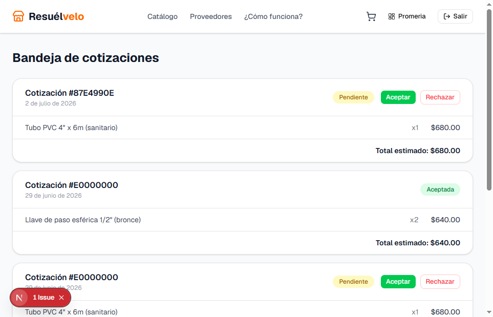
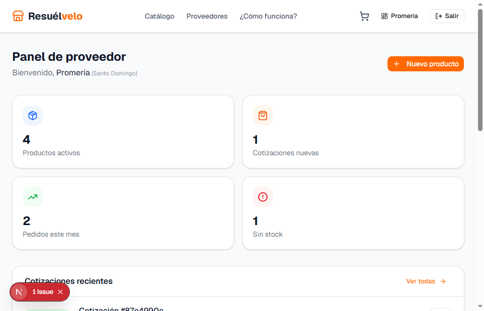

# Resuélvelo

Marketplace B2B que conecta compradores profesionales (contratistas, constructoras y PYMEs) con proveedores de materiales, insumos y servicios en República Dominicana. Los compradores exploran un catálogo multi-proveedor, arman un carrito y solicitan cotizaciones; los proveedores publican su catálogo y responden esas solicitudes desde un panel propio.

**🔗 Demo en vivo:** [resuelveloapp.vercel.app](https://resuelveloapp.vercel.app)



## Objetivo

Reemplazar el proceso manual de "llamar a varias ferreterías para comparar precios" por un flujo digital: un solo catálogo, cotizaciones estructuradas y trazabilidad de pedidos para ambos lados del marketplace.

## Roles

- **Comprador** — explora el catálogo, arma un carrito y solicita cotizaciones a uno o varios proveedores a la vez.
- **Proveedor** — publica y administra su catálogo de productos/servicios, y responde las cotizaciones que recibe.
- **Admin** — rol reservado en el modelo de datos para moderación futura (sin panel propio en este MVP).

## Stack técnico

- **Next.js 16** (App Router, Server Components + Server Actions) · **React 19** · **TypeScript**
- **Tailwind CSS v4** + **shadcn/ui** (`@base-ui/react`) para la interfaz
- **Supabase** — Postgres, Auth (email/password) y Row Level Security como única capa de autorización de datos
- **Zustand** — carrito de compras persistido en `localStorage`
- **Vitest** + Testing Library para pruebas unitarias

## Funcionalidad implementada

- Registro / login / logout con Supabase Auth y redirección según rol (`app/(auth)/`)
- Recuperación de contraseña por email (`/recuperar` → `/actualizar-password`)
- Catálogo con búsqueda por texto y filtro por categoría, leído directo de Supabase con **fallback automático a datos mock** si no hay credenciales configuradas (`lib/data.ts`)
- Carrito de compras (agregar, editar cantidad, vaciar) persistido en el navegador
- Solicitud de cotizaciones desde el carrito: se agrupan los items por proveedor y se crea una cotización por cada uno, resolviendo el proveedor y el precio directo desde la base de datos (nunca confiando en datos del cliente)
- Panel de proveedor: estadísticas, listado de productos con activar/desactivar/editar/**eliminar**, y bandeja de cotizaciones con aceptar/rechazar
- Row Level Security en Postgres: cada usuario solo puede leer/escribir lo que le corresponde, incluso si la UI fallara

## Capturas

| Catálogo | Carrito |
|---|---|
|  |  |

| Mis cotizaciones (comprador) | Bandeja de cotizaciones (proveedor) |
|---|---|
|  |  |

| Panel de proveedor |
|---|
|  |

## Puesta en marcha local

### 1. Requisitos

- Node.js 20.9+
- Una cuenta gratuita en [supabase.com](https://supabase.com)

### 2. Instalar dependencias

```bash
npm install
```

### 3. Configurar Supabase

1. Crear un proyecto nuevo en [supabase.com](https://supabase.com/dashboard).
2. En **SQL Editor**, ejecutar en orden:
   - [`supabase/schema.sql`](supabase/schema.sql) — tablas, índices, RLS y el trigger que crea el `profile` al registrarse.
   - [`supabase/seed.sql`](supabase/seed.sql) — categorías, proveedores, productos y cotizaciones de demo.
3. En **Project Settings → API**, copiar la `Project URL` y la `anon public key`.

### 4. Variables de entorno

Copiar `.env.example` a `.env.local` y completar:

```bash
cp .env.example .env.local
```

```env
NEXT_PUBLIC_SUPABASE_URL=https://<project-ref>.supabase.co
NEXT_PUBLIC_SUPABASE_ANON_KEY=<anon-public-key>
NEXT_PUBLIC_SITE_URL=http://localhost:3000
```

> Si dejás `NEXT_PUBLIC_SUPABASE_URL` con el valor de ejemplo, la app sigue funcionando: el catálogo y los proveedores se sirven desde datos mock en `lib/mock.ts`, útil para explorar la interfaz sin configurar nada. El registro, login y cotizaciones sí requieren credenciales reales de Supabase.

### 5. Correr en desarrollo

```bash
npm run dev
```

Abrir [http://localhost:3000](http://localhost:3000).

### 6. Credenciales de demo

Si corriste `seed.sql`, podés ingresar con cualquiera de estos usuarios (contraseña `Demo1234!` para todos):

| Email | Rol | Empresa |
|---|---|---|
| `comprador@demo.com` | Comprador | Construcciones Herrera |
| `promeria@demo.com` | Proveedor | Promeria (plomería) |
| `lopez@demo.com` | Proveedor | Ferretería López |
| `norte@demo.com` | Proveedor | Materiales del Norte |
| `solartech@demo.com` | Proveedor | SolarTech RD |
| `autochequeo@demo.com` | Proveedor | AutoChequeo RD |

## Scripts disponibles

```bash
npm run dev      # servidor de desarrollo (Webpack)
npm run build    # build de producción
npm run start    # servir el build de producción
npm run lint     # ESLint
npm run test     # pruebas unitarias (Vitest)
npm run test:watch
```

## Estructura del proyecto

```
app/
  (auth)/                 # login, registro, recuperar contraseña
  (marketplace)/           # catálogo, proveedores, carrito → cotizaciones, panel de proveedor
  como-funciona/, terminos/, privacidad/
components/
  layout/                 # Navbar, Footer
  marketplace/            # ProductoCard, CarritoDrawer, formularios, botones de acción
  ui/                     # primitivas shadcn/ui
lib/
  data.ts                 # capa de datos (Supabase con fallback a mock)
  mock.ts                 # datos de demo sin Supabase
  store/carrito.ts         # store de carrito (Zustand)
  supabase/               # clientes browser/server y refresco de sesión
supabase/
  schema.sql, seed.sql    # DDL, RLS y datos de demo
tests/                    # pruebas unitarias (Vitest)
docs/
  ROADMAP.md              # plan de desarrollo y fases
  PROYECTO-FINAL.md       # checklist de entrega académica
```

## Pruebas

```bash
npm run test
```

Cubren: el store del carrito (`tests/carrito.test.ts`), la integridad de los datos mock (`tests/mock.test.ts`), el fallback de `lib/data.ts` sin credenciales (`tests/data-fallback.test.ts`) y los tipos del dominio (`tests/tipos.test.ts`).

## Despliegue

Desplegado en Vercel: **[resuelveloapp.vercel.app](https://resuelveloapp.vercel.app)** (framework Next.js autodetectado, sin configuración adicional). Variables de entorno configuradas en el proyecto de Vercel: las mismas tres de `.env.local`, con `NEXT_PUBLIC_SITE_URL=https://resuelveloapp.vercel.app`.

Para desplegar tu propia copia:

```bash
npx vercel deploy --prod
```

Y configurar las variables de entorno desde el dashboard de Vercel (Project Settings → Environment Variables) o vía CLI:

```bash
npx vercel env add NEXT_PUBLIC_SUPABASE_URL production
npx vercel env add NEXT_PUBLIC_SUPABASE_ANON_KEY production
npx vercel env add NEXT_PUBLIC_SITE_URL production
```

## Licencia

[MIT](LICENSE)
